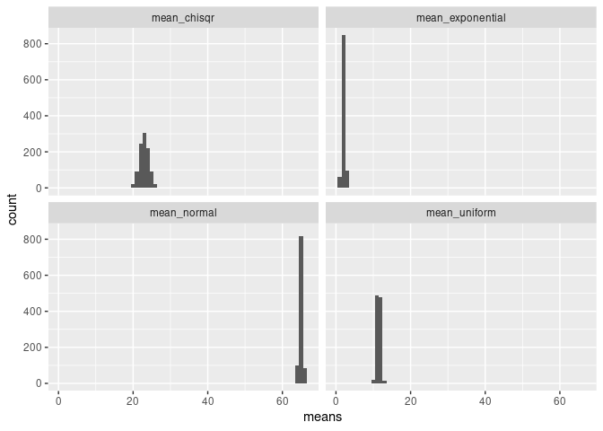
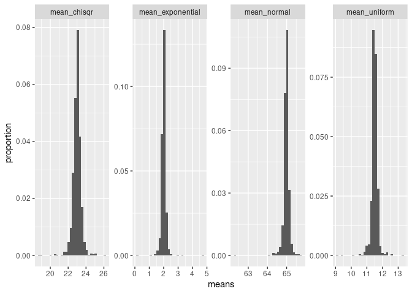
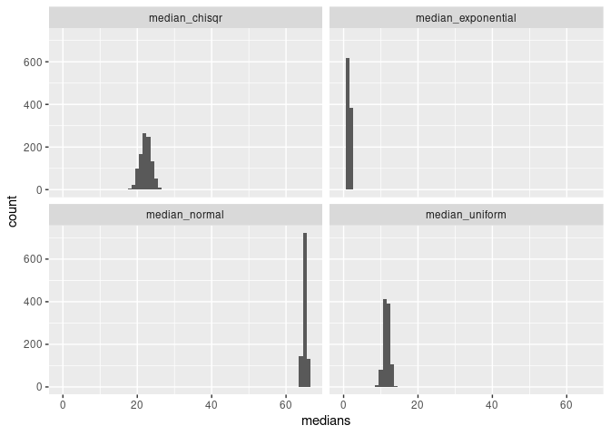

Activity 11 - Simulation
================
Luke Cadagin

## The Central Limit Theorem

From your introductory statistics course, recall that the **Central
Limit Theorem** tells us about the distribution of a sample mean, which
is called the sampling distribution. As sample size becomes sufficiently
large, the sampling distribution approaches a normal distribution and
the standard deviation of the sampling distribution decreases.

In this activity, we will explore these findings with a statistical
simulations. **For this activity, we will use a seed of 518.**

Note that when you knit your report, your results will always be the
same; however, if you re-run code chunks individually, they use
different seeds. One way to make sure that you get similar results each
time is to always run all previous code chunks  before running the current code
chunk .

## Set-up

For this activity, you will need the `{tidyverse}`.

``` r
library(tidyverse)
```

## Exploration

### Normally distributed population

Below I generate 1,000 samples from a Normally distributed random
variable with a mean 50 and standard deviation 10 and constructed a
*histogram* and overlay a line for the distribution.

``` r
norm_samp_1000 <- tibble(
  values = rnorm(n = 1000, mean = 50, sd = 10)
)

ggplot(norm_samp_1000, aes(x = values)) + 
  geom_histogram(aes(y = ..count.. / sum(..count..)),       # plot proportion instead of count
                 fill = "white",
                 color = "black",
                 binwidth = 3) +                            # specify how big bins should be
  stat_function(fun = function(x)                           # some rescaling "magic" to get correct densities
                      dnorm(x, mean = 50, sd = 10) * 3,     # see: https://stackoverflow.com/a/36344354
                color = "#0065a4",                          # laker-blue is #0065a4
                size = 2,                                   # make line a little thicker
                alpha = 0.4) +                                
  geom_vline(xintercept = mean(norm_samp_1000$values),      # plot vline at mean of sample
             color = "#a43f00",                             # pick a color to contrast blue
             size = 2) +
  theme_minimal() +                                         # get ride of chart junk
  labs(y = "proportion")                                    # rename y axis
```

<!-- -->

Using `norm_samp_1000`, obtain the mean and standard deviation of this
sample?

``` r
norm_samp_1000 %>% 
  summarize(mean = mean(values), stan_dev = sd(values))
```

    ## # A tibble: 1 x 2
    ##    mean stan_dev
    ##   <dbl>    <dbl>
    ## 1  50.2     9.59

Now, create a new simulation. In this you will obtain a sample of size
30 from from a Normally distributed variable with a mean 50 and standard
deviation 10, and find the mean and standard deviation. How do the mean
and standard deviation compare to your answers above?

``` r
norm_samp_30 <- tibble(
  values = rnorm(n = 30, mean = 50, sd = 10)
)
norm_samp_30 %>% 
  summarize(mean = mean(values), stan_dev = sd(values))
```

    ## # A tibble: 1 x 2
    ##    mean stan_dev
    ##   <dbl>    <dbl>
    ## 1  47.8     9.87

The mean is slightly smaller and sd is slightly larger than the 1000
sample.

### Non-normally distributed population

Using a similar process, obtain Exponentially distributed variable
(`?rexp`) with a *rate* of 0.02. Obtain a sample of 1,000 observations
and a sample of 30 observations. Then, calculate the mean and standard
deviation of each sample and discuss how the values are similar and how
they differ.

``` r
exp_samp_1000 <- tibble(
  values = rexp(n = 1000, rate = .02)
)

exp_samp_1000 %>% 
  summarize(mean = mean(values), stan_dev = sd(values))
```

    ## # A tibble: 1 x 2
    ##    mean stan_dev
    ##   <dbl>    <dbl>
    ## 1  48.3     49.6

``` r
exp_samp_30 <- tibble(
  values = rexp(n = 30, rate = .02)
)

exp_samp_30 %>% 
  summarize(mean = mean(values), stan_dev = sd(values))
```

    ## # A tibble: 1 x 2
    ##    mean stan_dev
    ##   <dbl>    <dbl>
    ## 1  36.5     34.9

The mean and the stan\_dev are very close to each other for both sample
sizes (1000 and 30). The mean and standard deviation is farther away
from each other for the 30 sample than the 1000 sample.

 **Planned Pause Point**: If you have any
questions, contact your instructor. Otherwise feel free to continue on.

## Many distributions

We previously looked at one distribution at a time. It would be nice to
explore multiple distributions simulataneouly. To do this, we will
create a new function. Yay!

Write a function (say, `generate_n_samples`) that takes `n` (how many
values to sample) as its argument. This function should produce a
dataset containing four columns: one that generates data from a
**Normal** distribution (parameters mean and standard deviation), one
from a **Exponential** distribution (parameter rate), one from a
**Chi-square**
distribution`(parameter degrees of freedom), and one from a **Uniform** distribution (parameters minimum and maximum). This function should produce a dataset with`n\`
rows.

You should **not** use the default parameter options for these
distributions (e.g., your Normal data should not have a mean of 0 or a
standard deviation of 1). Test your function with `n = 30` and
`n = 1000`.

``` r
generate_n_samples <- function(n) {
  normal <- rnorm(n = n, mean = 65, sd = 2)
  exponential <- rexp(n = n, rate = .5)
  chisqr <- rchisq(n = n, df = 23)
  uniform <- runif(n = n, min = 7, max = 16)
  output <- tibble(normal, exponential, chisqr, uniform)
}

test_1000 <- generate_n_samples(1000)
test_30 <- generate_n_samples(30)

test_1000
```

    ## # A tibble: 1,000 x 4
    ##    normal exponential chisqr uniform
    ##     <dbl>       <dbl>  <dbl>   <dbl>
    ##  1   64.0      1.75     24.9    9.23
    ##  2   66.2      0.278    32.2   12.3 
    ##  3   67.5      0.396    28.6    8.44
    ##  4   66.5      4.07     24.1   14.2 
    ##  5   66.8      1.57     27.1    9.79
    ##  6   68.4      0.138    26.7   13.2 
    ##  7   67.3      1.76     20.3    8.04
    ##  8   65.7      0.831    20.6    7.61
    ##  9   65.6      1.03     14.6   13.8 
    ## 10   65.2      0.0719   27.5    8.26
    ## # … with 990 more rows

``` r
test_30
```

    ## # A tibble: 30 x 4
    ##    normal exponential chisqr uniform
    ##     <dbl>       <dbl>  <dbl>   <dbl>
    ##  1   65.7       3.37    18.2    8.13
    ##  2   62.8       1.14    30.3   14.5 
    ##  3   62.6       0.247   18.9   14.6 
    ##  4   61.0       1.42    27.8    7.03
    ##  5   68.4       1.33    22.8    9.51
    ##  6   66.0       3.29    29.9   15.2 
    ##  7   62.8       1.30    32.6   13.0 
    ##  8   63.1       0.240   22.3    8.08
    ##  9   66.3       4.99    25.1    7.97
    ## 10   65.3       1.30    19.6   13.7 
    ## # … with 20 more rows

Keep the following information in mind for the rest of this activity.
The mean and standard deviation for each of the general distributions we
are using in this activity are (using the R function arguments):

-   [Normal
    distribution](https://en.wikipedia.org/wiki/Normal_distribution):
    mean = `mean`, standard deviation = `sd`
-   [Exponential
    distribution](https://en.wikipedia.org/wiki/Exponential_distribution):
    mean = 1 / `rate`, standard deviation = 1 / `rate`
-   [Chi-square
    distribution](https://en.wikipedia.org/wiki/Chi-squared_distribution):
    mean = `df`, standard deviation = sqrt(2 \* `df`)
-   [Uniform
    distribution](https://en.wikipedia.org/wiki/Continuous_uniform_distribution):
    (`min` + `max`) / 2, standard deviation = (`max` - `min`) / sqrt(12)

``` r
test_1000 %>% 
  summarize(mean_norm = mean(normal), stan_dev_norm = sd(normal), mean_exp = mean(exponential), stan_dev_exp = sd(exponential), mean_chisqr = mean(chisqr), stan_dev_chisqr = sd(chisqr), mean_unif = mean(uniform), stan_dev_unif = sd(uniform))
```

    ## # A tibble: 1 x 8
    ##   mean_norm stan_dev_norm mean_exp stan_dev_exp mean_chisqr stan_dev_chisqr
    ##       <dbl>         <dbl>    <dbl>        <dbl>       <dbl>           <dbl>
    ## 1      65.1          1.96     2.02         2.12        23.3            6.85
    ## # … with 2 more variables: mean_unif <dbl>, stan_dev_unif <dbl>

Complete the table below with the **mean and standard deviation** values
for your specific distributions. These are the “population values”.

| Distribution | Mean  | SD   |
|--------------|-------|------|
| Normal       | 65.1  | 1.96 |
| Exponential  | 2.02  | 2.12 |
| Chi-square   | 23.31 | 6.85 |
| Uniform      | 11.38 | 2.62 |

Below I provide you with a function that calculates the sample mean for
each column/distribution.

``` r
sample_mean <- function(.data){
  .data %>% 
    summarise(across(everything(), mean, .names = "mean_{.col}"))
}

sample_mean(test_1000)
```

    ## # A tibble: 1 x 4
    ##   mean_normal mean_exponential mean_chisqr mean_uniform
    ##         <dbl>            <dbl>       <dbl>        <dbl>
    ## 1        65.1             2.02        23.3         11.4

First, verify that you know what each line of this function is doing.
Then, use this function in addition to your multiple distribution sample
generator from above to calculate the means for `n = 30` and `n = 1000`
Discuss how the means compares for each distribution. Note that it
doesn’t make sense to compare means/standard deviations across the
distributions.

``` r
sample_mean(generate_n_samples(1000))
```

    ## # A tibble: 1 x 4
    ##   mean_normal mean_exponential mean_chisqr mean_uniform
    ##         <dbl>            <dbl>       <dbl>        <dbl>
    ## 1        65.0             2.00        23.3         11.6

``` r
sample_mean(generate_n_samples(30))
```

    ## # A tibble: 1 x 4
    ##   mean_normal mean_exponential mean_chisqr mean_uniform
    ##         <dbl>            <dbl>       <dbl>        <dbl>
    ## 1        64.6             1.93        24.4         11.4

When the sample size is larger, the mean is much closer to the true
mean.

## Many samples

We previously looked at taking one sample at a time. To explore the
Central Limit Theorem (CLT), we need to generate multiple samples. The
`BASE::replicate`, `purrr::rerun`, or `purr::map_*` functions are
convenient ways to generate multiple samples of data.

    # Each of these generate 1,000 samples of n = 30 from a normal(mean = 50, sd = 10)

    # BASE::replicate()
    ## simplify = FALSE keeps the results as a list 
    ## rather than coercing them to an array/matrix
    replicate(1000, rnorm(30, mean = 50, sd = 10), simplify = FALSE)

    # purrr::rerun
    rerun(1000, rnorm(30, mean = 50, sd = 10))

    # This could also be done in purr::map 
    map(1:1000, ~rnorm(30, mean = 50, sd = 10))

Continuing to work with your multiple distribution sample generator from
above, generate 1,000 samples from the four distributions each with size
30. We will want to continue to work with this list so be sure to assign
these samples to an appropriately named object (say,
`multiple_samples`).

``` r
multiple_samples <- map(1:1000, ~generate_n_samples(30))
head(multiple_samples)
```

    ## [[1]]
    ## # A tibble: 30 x 4
    ##    normal exponential chisqr uniform
    ##     <dbl>       <dbl>  <dbl>   <dbl>
    ##  1   61.9       1.34    37.2   15.0 
    ##  2   65.0       9.61    23.5    9.85
    ##  3   67.3       8.57    24.0   15.5 
    ##  4   61.7       0.366   17.6   11.8 
    ##  5   65.9       3.47    26.1   11.3 
    ##  6   64.7       1.82    22.0   15.2 
    ##  7   64.8       0.249   20.8   10.1 
    ##  8   64.3       0.579   44.6    9.92
    ##  9   64.9       0.106   21.3   13.6 
    ## 10   63.6       1.90    17.5   15.1 
    ## # … with 20 more rows
    ## 
    ## [[2]]
    ## # A tibble: 30 x 4
    ##    normal exponential chisqr uniform
    ##     <dbl>       <dbl>  <dbl>   <dbl>
    ##  1   62.5       1.61    29.1    7.56
    ##  2   68.2       3.40    17.3    9.86
    ##  3   64.5       7.03    22.2    9.94
    ##  4   67.3       0.415   20.9   12.0 
    ##  5   63.7       1.11    22.8   14.8 
    ##  6   62.9       6.82    16.1   13.5 
    ##  7   64.1       8.51    17.6   14.4 
    ##  8   66.9       4.42    26.0   13.5 
    ##  9   63.0       0.119   22.2    8.38
    ## 10   65.4       0.963   23.9   14.8 
    ## # … with 20 more rows
    ## 
    ## [[3]]
    ## # A tibble: 30 x 4
    ##    normal exponential chisqr uniform
    ##     <dbl>       <dbl>  <dbl>   <dbl>
    ##  1   64.0      1.83    23.7     10.4
    ##  2   63.9      2.47    22.9     12.4
    ##  3   65.1      2.26    16.8     15.7
    ##  4   64.0      2.51    16.1     15.8
    ##  5   64.4      2.33    22.8     12.6
    ##  6   63.4      1.75    17.5     12.5
    ##  7   64.7      0.435    8.42    13.7
    ##  8   64.4      7.11    42.6     11.5
    ##  9   63.5      6.65    23.9     13.1
    ## 10   64.9      0.0432  33.7     15.4
    ## # … with 20 more rows
    ## 
    ## [[4]]
    ## # A tibble: 30 x 4
    ##    normal exponential chisqr uniform
    ##     <dbl>       <dbl>  <dbl>   <dbl>
    ##  1   63.5       0.372   17.5   15.7 
    ##  2   65.1       1.35    27.2   15.0 
    ##  3   66.4       0.940   22.5   10.4 
    ##  4   64.2       2.37    21.7   11.8 
    ##  5   65.8       0.733   31.5    7.55
    ##  6   66.5       0.661   21.1    7.91
    ##  7   65.5       1.23    17.2   12.0 
    ##  8   62.1       1.53    21.5   13.0 
    ##  9   65.8       3.76    11.7    7.12
    ## 10   66.2       2.41    44.6   15.2 
    ## # … with 20 more rows
    ## 
    ## [[5]]
    ## # A tibble: 30 x 4
    ##    normal exponential chisqr uniform
    ##     <dbl>       <dbl>  <dbl>   <dbl>
    ##  1   66.4       0.263   10.8    8.80
    ##  2   67.5       2.07    23.5   10.3 
    ##  3   62.5       4.90    19.3   14.3 
    ##  4   65.6       0.617   13.9   14.2 
    ##  5   67.4       3.30    23.3   10.0 
    ##  6   63.1       0.889   23.1   15.6 
    ##  7   64.1       2.05    28.5   15.3 
    ##  8   65.9       4.23    19.8    9.70
    ##  9   63.0       1.33    12.2   14.2 
    ## 10   62.6       0.484   35.1   11.4 
    ## # … with 20 more rows
    ## 
    ## [[6]]
    ## # A tibble: 30 x 4
    ##    normal exponential chisqr uniform
    ##     <dbl>       <dbl>  <dbl>   <dbl>
    ##  1   63.5      6.75     14.6   12.5 
    ##  2   65.8      0.488    14.4   13.9 
    ##  3   63.6      1.61     19.3    7.47
    ##  4   63.6      1.14     25.4   10.8 
    ##  5   66.8      0.237    18.7    8.71
    ##  6   66.2      1.09     15.5   15.0 
    ##  7   67.9      0.0585   20.7    7.28
    ##  8   59.5      2.74     15.4   12.0 
    ##  9   68.3      0.222    33.4    8.89
    ## 10   67.3      1.29     22.5   10.9 
    ## # … with 20 more rows

Calculate the sample mean of each sample using the appropriate `map`
function and my `sample_mean` function to produce a *data frame* of
multiple sample means from your multiple samples object. Assign these
sample means to an appropriately named object.

``` r
sample_means_multiple_samples <- map(multiple_samples, ~sample_mean(.))
```

``` r
sample_means_multiple_samples <- bind_rows(sample_means_multiple_samples)
head(sample_means_multiple_samples)
```

    ## # A tibble: 6 x 4
    ##   mean_normal mean_exponential mean_chisqr mean_uniform
    ##         <dbl>            <dbl>       <dbl>        <dbl>
    ## 1        64.9             2.45        23.4         12.1
    ## 2        65.0             2.25        22.3         12.1
    ## 3        64.5             2.56        23.6         11.5
    ## 4        65.4             1.84        22.9         11.4
    ## 5        65.0             1.85        23.5         11.5
    ## 6        65.4             1.80        23.8         11.3

Restructure your previous sample means R object to, instead of having
1,000 rows and 4 columns, have 4,000 rows and 2 columns where the
columns are named `distribution` and `means`. Assign this restructured
data to an appropriately named object.

``` r
sample_means_by_distibution <- sample_means_multiple_samples %>% 
  pivot_longer(cols = c(mean_normal, mean_exponential, mean_chisqr, mean_uniform), names_to = "distribution", values_to = "means")

head(sample_means_by_distibution)
```

    ## # A tibble: 6 x 2
    ##   distribution     means
    ##   <chr>            <dbl>
    ## 1 mean_normal      64.9 
    ## 2 mean_exponential  2.45
    ## 3 mean_chisqr      23.4 
    ## 4 mean_uniform     12.1 
    ## 5 mean_normal      65.0 
    ## 6 mean_exponential  2.25

Using the restructured data, create a histogram for each `distribution`
using a *facet* layer.

``` r
sample_means_by_distibution %>% 
  ggplot() +
  geom_histogram(mapping = aes(x = means), binwidth = 1) +
  facet_wrap(~distribution)
```

<!-- -->

Comment on each of shape of each of the mean plots above. How was the
distribution of the sample means different than the distribution of the
population? Note, looking at the wiki pages linked early in this
activity will help you compare your sample mean distributions to the
population distributions.

All of the distributions above are tightly packed (have small standard
errors). They also all appear to be approximately normal distributions.
This was different than the distribution of the population because not
every population distribution is normal.

Using the restructured data, obtain the mean and standard deviation
**for each** of the distributions.

``` r
sample_means_by_distibution %>% 
  group_by(distribution) %>% 
  summarize(mean = mean(means), stand_dev = sd(means))
```

    ## # A tibble: 4 x 3
    ##   distribution      mean stand_dev
    ##   <chr>            <dbl>     <dbl>
    ## 1 mean_chisqr      23.0      1.25 
    ## 2 mean_exponential  2.01     0.359
    ## 3 mean_normal      65.0      0.368
    ## 4 mean_uniform     11.5      0.475

Comment on how each mean compares to the “population values” mean that
you calculated above.

| Distribution | Mean  | SD   |
|--------------|-------|------|
| Normal       | 65.1  | 1.96 |
| Exponential  | 2.02  | 2.12 |
| Chi-square   | 23.31 | 6.85 |
| Uniform      | 11.38 | 2.62 |

The means of these standard deviations are very close to the “population
values” means from above (little difference).

Comment on how each standard deviation compares to the “population
values” standard deviation that you calculated above.

The standard deviations are much smaller than the “population values”
standard deviations from above (large difference).

 **Planned Pause Point**: If you have any
questions, contact your instructor. Otherwise feel free to continue on.

## Larger sample size

You previously explored how the distribution of sample means for
`n = 30` behaves for four specific distributions. Now, I will do this
for `n = 100`. Update the parameter arguments in
`distribution_exploration` with the values that you have been working
with. You can explore my quickly-assembled function if you are
interested. After you run the code below, be sure to click through the
different viewer windows to see the plots and summary tables. The first
view widow should simply tell you “`stat_bin()` using `bins = 30`. Pick
better value with `binwidth`.”

``` r
source(here::here("functions", "helper.R"))

distribution_exploration(n = 100, rep = 1000, mean = 65, sd = 2, rate = 0.5, df = 23, min = 7, max = 16)
```

    ## [[1]]

    ## `stat_bin()` using `bins = 30`. Pick better value with `binwidth`.

<!-- -->

    ## 
    ## [[2]]
    ## # A tibble: 4 x 3
    ##   distribution      mean    sd
    ##   <chr>            <dbl> <dbl>
    ## 1 mean_chisqr      23.0  0.495
    ## 2 mean_exponential  2.00 0.174
    ## 3 mean_normal      65.0  0.164
    ## 4 mean_uniform     11.5  0.221

How do these values compare to your work with `n = 30`?

For a sample size of n = 100, the average sample mean is much closer to
the true mean and the standard error is much smaller (data is less
spread out) than when you compare to a sample size of n = 30.

### Challenge 1

Hopefully, this version of the CLT seems like a refresher. However, it
would be nice to see if this holds for other statistics? Instead of
calculating the mean of each of the 1,000 samples, explore one or a few
(or all) of the following summary statistics:

-   median
-   midhinge
-   maximum
-   standard deviation
-   IQR

``` r
multiple_samples2 <- map(1:1000, ~generate_n_samples(30))
head(multiple_samples)
```

    ## [[1]]
    ## # A tibble: 30 x 4
    ##    normal exponential chisqr uniform
    ##     <dbl>       <dbl>  <dbl>   <dbl>
    ##  1   61.9       1.34    37.2   15.0 
    ##  2   65.0       9.61    23.5    9.85
    ##  3   67.3       8.57    24.0   15.5 
    ##  4   61.7       0.366   17.6   11.8 
    ##  5   65.9       3.47    26.1   11.3 
    ##  6   64.7       1.82    22.0   15.2 
    ##  7   64.8       0.249   20.8   10.1 
    ##  8   64.3       0.579   44.6    9.92
    ##  9   64.9       0.106   21.3   13.6 
    ## 10   63.6       1.90    17.5   15.1 
    ## # … with 20 more rows
    ## 
    ## [[2]]
    ## # A tibble: 30 x 4
    ##    normal exponential chisqr uniform
    ##     <dbl>       <dbl>  <dbl>   <dbl>
    ##  1   62.5       1.61    29.1    7.56
    ##  2   68.2       3.40    17.3    9.86
    ##  3   64.5       7.03    22.2    9.94
    ##  4   67.3       0.415   20.9   12.0 
    ##  5   63.7       1.11    22.8   14.8 
    ##  6   62.9       6.82    16.1   13.5 
    ##  7   64.1       8.51    17.6   14.4 
    ##  8   66.9       4.42    26.0   13.5 
    ##  9   63.0       0.119   22.2    8.38
    ## 10   65.4       0.963   23.9   14.8 
    ## # … with 20 more rows
    ## 
    ## [[3]]
    ## # A tibble: 30 x 4
    ##    normal exponential chisqr uniform
    ##     <dbl>       <dbl>  <dbl>   <dbl>
    ##  1   64.0      1.83    23.7     10.4
    ##  2   63.9      2.47    22.9     12.4
    ##  3   65.1      2.26    16.8     15.7
    ##  4   64.0      2.51    16.1     15.8
    ##  5   64.4      2.33    22.8     12.6
    ##  6   63.4      1.75    17.5     12.5
    ##  7   64.7      0.435    8.42    13.7
    ##  8   64.4      7.11    42.6     11.5
    ##  9   63.5      6.65    23.9     13.1
    ## 10   64.9      0.0432  33.7     15.4
    ## # … with 20 more rows
    ## 
    ## [[4]]
    ## # A tibble: 30 x 4
    ##    normal exponential chisqr uniform
    ##     <dbl>       <dbl>  <dbl>   <dbl>
    ##  1   63.5       0.372   17.5   15.7 
    ##  2   65.1       1.35    27.2   15.0 
    ##  3   66.4       0.940   22.5   10.4 
    ##  4   64.2       2.37    21.7   11.8 
    ##  5   65.8       0.733   31.5    7.55
    ##  6   66.5       0.661   21.1    7.91
    ##  7   65.5       1.23    17.2   12.0 
    ##  8   62.1       1.53    21.5   13.0 
    ##  9   65.8       3.76    11.7    7.12
    ## 10   66.2       2.41    44.6   15.2 
    ## # … with 20 more rows
    ## 
    ## [[5]]
    ## # A tibble: 30 x 4
    ##    normal exponential chisqr uniform
    ##     <dbl>       <dbl>  <dbl>   <dbl>
    ##  1   66.4       0.263   10.8    8.80
    ##  2   67.5       2.07    23.5   10.3 
    ##  3   62.5       4.90    19.3   14.3 
    ##  4   65.6       0.617   13.9   14.2 
    ##  5   67.4       3.30    23.3   10.0 
    ##  6   63.1       0.889   23.1   15.6 
    ##  7   64.1       2.05    28.5   15.3 
    ##  8   65.9       4.23    19.8    9.70
    ##  9   63.0       1.33    12.2   14.2 
    ## 10   62.6       0.484   35.1   11.4 
    ## # … with 20 more rows
    ## 
    ## [[6]]
    ## # A tibble: 30 x 4
    ##    normal exponential chisqr uniform
    ##     <dbl>       <dbl>  <dbl>   <dbl>
    ##  1   63.5      6.75     14.6   12.5 
    ##  2   65.8      0.488    14.4   13.9 
    ##  3   63.6      1.61     19.3    7.47
    ##  4   63.6      1.14     25.4   10.8 
    ##  5   66.8      0.237    18.7    8.71
    ##  6   66.2      1.09     15.5   15.0 
    ##  7   67.9      0.0585   20.7    7.28
    ##  8   59.5      2.74     15.4   12.0 
    ##  9   68.3      0.222    33.4    8.89
    ## 10   67.3      1.29     22.5   10.9 
    ## # … with 20 more rows

``` r
sample_median <- function(.data){
  .data %>% 
    summarise(across(everything(), median, .names = "median_{.col}"))
}
```

``` r
sample_medians_multiple_samples <- map(multiple_samples, ~sample_median(.))
```

``` r
sample_medians_multiple_samples <- bind_rows(sample_medians_multiple_samples)
head(sample_medians_multiple_samples)
```

    ## # A tibble: 6 x 4
    ##   median_normal median_exponential median_chisqr median_uniform
    ##           <dbl>              <dbl>         <dbl>          <dbl>
    ## 1          64.8               1.56          22.2           12.0
    ## 2          65.0               1.22          22.8           12.7
    ## 3          64.6               2.25          22.9           11.2
    ## 4          65.6               1.01          21.8           11.9
    ## 5          65.0               1.29          23.4           10.6
    ## 6          65.6               1.11          23.2           11.8

``` r
sample_medians_by_distibution <- sample_medians_multiple_samples %>% 
  pivot_longer(cols = c(median_normal, median_exponential, median_chisqr, median_uniform), names_to = "distribution", values_to = "medians")

head(sample_medians_by_distibution)
```

    ## # A tibble: 6 x 2
    ##   distribution       medians
    ##   <chr>                <dbl>
    ## 1 median_normal        64.8 
    ## 2 median_exponential    1.56
    ## 3 median_chisqr        22.2 
    ## 4 median_uniform       12.0 
    ## 5 median_normal        65.0 
    ## 6 median_exponential    1.22

``` r
sample_medians_by_distibution %>% 
  ggplot() +
  geom_histogram(mapping = aes(x = medians), binwidth = 1) +
  facet_wrap(~distribution)
```

<!-- -->

## Challenge 2: Apply this knowledge

GVSU claims that the Laker Line bus route has a 10 minute wait time
during the peak hours of 7 am - 9 pm
(<https://www.gvsu.edu/bus/bus-route-ll-gvsu-laker-line-weekday-69.htm>).
Assume that wait times are Exponentially distributed with a mean of 10
minutes. For Exponentially distributed variables, remember that mean = 1
/ `rate`. What is the `rate` of our population distribution?

mean = 1 / rate 10 = 1 / rate rate = .1

You think this might be a lie. In the last 30 days during peak hours,
you have waited for the bus an average of 15 minutes.

If the bus system is telling the truth, how unlucky have you been this
past month? You will make an argument both by direct simulation and
using the CLT. (*Hint for CLT, i.e., z-score, method: remember that the
sd is equal to the mean.*)

### Using simulation

To do this,

1.  Simulate 30 random values (a sample of 30 days) from the appropriate
    exponential distribution.
2.  Do (1), 1,000 times
3.  Calculate the mean of each of the 1,000 samples
4.  Calculate what percentage of the sample means waited as long or
    longer than you.

``` r
wait_time_sample_30 <- rexp(n = 30, rate = .1)
wait_time_sample_30
```

    ##  [1]  0.1857114  3.2569496  7.8444663  8.3092987  5.1607302  1.1596555
    ##  [7] 12.0338847 10.9347229 18.3343243 34.9465819 20.6485388  2.7628270
    ## [13]  3.9977099  6.6695367  6.8928409  2.8943260  4.9277342  4.4554994
    ## [19]  4.0403874  8.9173257  8.5179342  1.3313237  6.2186759  8.4258962
    ## [25] 17.7163189  2.9393669 10.0866583  5.7719695  5.1871339 12.4662928

``` r
multiple_samples <- map(1:1000, ~rexp(n = 30, rate = .1))
```

``` r
head(multiple_samples)
```

    ## [[1]]
    ##  [1]  9.4450123 13.9493268  2.3699986  0.6142589 13.6027984  1.1341298
    ##  [7] 17.9502337  5.7447268  1.9537155 13.6908222  4.8472128  2.5981228
    ## [13]  5.6110616 21.2046926  3.0486307 24.9176681  2.8941809  3.6273054
    ## [19]  6.8225538 39.8002542 15.5452755  2.0704225  7.7050660 14.3461948
    ## [25]  1.2764922  1.7757975 53.1633327  8.2760306 19.0439410  5.6057683
    ## 
    ## [[2]]
    ##  [1]  9.1168395  9.6986634  3.6215307 24.7415174 13.7419962 20.4078047
    ##  [7]  8.6821849  2.6987327  1.9025498  3.9541728  0.5968372  0.3366985
    ## [13]  3.9237350  1.2978708  0.4751771 12.5774036  6.6593699 35.7217590
    ## [19]  4.0462499  2.0538452  1.4262541  2.1798967 10.7775377  1.3276362
    ## [25]  4.1692078  1.7130025  1.2918092  2.9680156  3.2916405 10.9826060
    ## 
    ## [[3]]
    ##  [1]  1.57235132  7.52805117  7.49884936  3.42818211 49.78571282  6.61278339
    ##  [7]  3.64545954  5.08969897  6.46386401 25.89693004  2.30269679 11.98099118
    ## [13]  8.94209799  0.34258573  8.30865222  0.31587754  5.57533573 11.53034558
    ## [19]  2.53445704  2.40504618 30.62189158 10.32219243 19.02489075  0.08302653
    ## [25] 12.73513379  2.50060460  6.16742265  7.56540614  7.64993750  3.67228295
    ## 
    ## [[4]]
    ##  [1]  7.66370579  0.85653017  1.48288723  2.76780578 13.92128643  8.36138853
    ##  [7]  5.13055751  5.23061887  0.04534682  7.03451281  3.42741227 38.81582087
    ## [13]  9.86616242  1.45314604  4.27009305 11.94533084 19.84523741  3.89334232
    ## [19] 34.26474765  1.38990130  1.32152546  3.92793383 48.76102000  7.61812575
    ## [25]  3.48922040 15.71475001  0.06673409 13.60822928  0.99710141  2.14734397
    ## 
    ## [[5]]
    ##  [1]  0.5547085  4.1264618  9.4257520  0.3937126  9.7261710  2.3906041
    ##  [7]  2.7690064  7.6451215  0.6532503  3.6052981  6.6518098 10.7334410
    ## [13] 10.2768474  3.4189717 25.8909024 23.5921428  6.1687382  8.8252545
    ## [19]  3.4677287 19.8054272  0.5614549  1.2589731  6.4701477  1.8015404
    ## [25]  3.9684004 17.2039541  2.1072214 10.8454755 17.4052480 11.8385055
    ## 
    ## [[6]]
    ##  [1] 16.3377243  2.6205962 22.7730965 14.9150482 17.6862816  2.7187518
    ##  [7] 25.5861591  7.8947792 13.6496504  4.2650201 15.1408766 37.3423216
    ## [13]  8.8099949 14.1906947  4.5130507  6.9179277  6.3046220  3.0053971
    ## [19] 14.2358175  0.1366614  0.4285957 13.5737218 10.7508265  2.2536205
    ## [25] 70.7518691  4.5180973 30.7663870  5.7419532  2.6248354 57.7049532

``` r
means_of_multiple_samples <- map(multiple_samples, ~mean(.))
```

``` r
means_of_multiple_samples <- unlist(means_of_multiple_samples)
```

``` r
tibble(means = means_of_multiple_samples) %>% 
  filter(means >= 15) %>% 
  summarize(prop = n() / 1000)
```

    ## # A tibble: 1 x 1
    ##    prop
    ##   <dbl>
    ## 1  0.01

### Using CLT

To do this,

1.  Recall that the CLT states that all potential sample means are
    approximately normal with mean 10 (GVSU’s claim) and a standard
    deviation of the population standard deviation (you calculated this
    by-hand above) divided by the square root of the sample size (30
    days).
2.  Find the probability from the normal distribution in (1) that a
    sample mean is as long as or longer than your time of 15 minutes.
    You do not need to use any simulations, simply the appropriate
    `xnorm` function (where `x` is replaced with the appropriate one of
    either `d`, `p`, `q`, or `r`).

``` r
1 - pnorm(15, mean = 10, sd = 10/sqrt(30))
```

    ## [1] 0.00308495

Comment on how similar/different your results were for the simulation
and CLT methods.

The simulation showed that the probability of an average bus wait time
is about 1% while the CLT method showed that the probability was about
.3%. Both very low probabilities.

Do you believe that bus wait times are Exponentially distributed?

No, I do not beilieve the bus wait times are Exponentially distributed.

 **Planned Pause Point**: If you have any
questions, contact your instructor. Otherwise feel free to continue on.

## Attribution

This activity is based on one of Kelly Bodwin’s [STA
331](https://www.kelly-bodwin.com/about/) labs.
